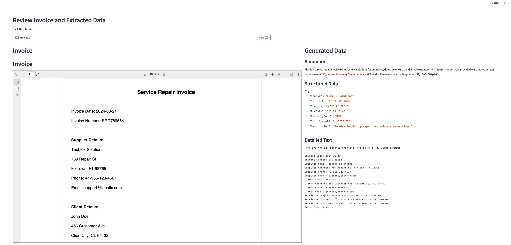

# Invoice Processing with Amazon Bedrock
Managing invoices is a critical yet often cumbersome task for businesses of all sizes. The sheer volume of data, coupled with the need for accuracy and efficiency, can make invoice processing a significant challenge. This code repo provides a solution using Streamlit application and Bedrock Anthropic models to streamline and automate the process.

This project demonstrates how to process PDF invoices stored in an Amazon S3 bucket using AWS Bedrock. Amazon Bedrock is a fully managed service for building generative AI applications that gives access to range of LLM's. In this project, we will extract the invoice data and summarize the invoice and finally store in a JSON file. Alternatively, you can store this JSON and key value in your operational databases as required.

## GenAI-powered invoice processing & review app

This application uses Amazon Bedrock Knowledge Base - Chat with document feature with Claude Sonnet LLM to extract information from pdf invoices and provides a streamlit app which displays the invoices and extracted information side-by-side for easier review. 

## Prerequisites

- Python 3.7 or later
- AWS CLI installed and configured with appropriate credentials
- Required Python packages (listed in `requirements.txt`)
- Store invoices (PDF) to a S3 bucket. PUT IT INSIDE A FOLDER (e.g. invoice)

## Create a S3 bucket to store the sample invoices via console or AWS CLI 

1. Create Bucket - 
    ```bash 
        aws s3 mb s3://your-bucket-name --region your-region 
    ```
    - Replace your-bucket-name with the desired name of your S3 bucket.
    - Replace your-region with the AWS region where you want the bucket to reside, such as us-east-1.

2. Using the below AWS cli command, copy your invoices from your local computer to the S3 bucket created in the step above. If you would like to create a folder within the S3 bucket and upload your invoices there, then follow the second command below.
    ```bash
        aws s3 cp /path/to/your/local/folder/with/invoices s3://your-bucket-name/ --recursive
    ```

        ```bash
        aws s3 cp /path/to/your/local/folder/with/invoices s3://your-bucket-name/folder/ --recursive
    ```

3. Validate the Upload
    ```bash 
        aws s3 ls s3://your-bucket-name/ 
    ```

## Initiaing the project by cloning this repo

1. Clone the repository:
    ```bash 
        git clone https://github.com/aws-samples/genai-invoice-processor.git
    ```

2. Navigate to the project directory:
    ```bash 
        cd genai-invoice-processor
    ```

3. Upgrade Pip
    ```bash 
        python3 -m pip install --upgrade pip
    ```

4. (Optional) Create a new virtual environment to isolate the project dependencies
    ```bash
        python3 -m venv venv
        # Mac/Linux:
        source venv/bin/activate
        # Windows:
        venv/Scripts/activate
    ```

3. Install the required Python packages:
    ```bash
        pip install -r requirements.txt
    ```

## Configuration

This project uses a `config.yaml` file for configuration. Before running the application, ensure you've reviewed and updated this file as needed:

- The file contains settings for AWS region and the Bedrock model ID.
- The default model is set to Calude 3 Sonnet, you can find the model IDs on https://docs.aws.amazon.com/bedrock/latest/userguide/model-ids.html
- It also specifies the output file path and local download folder for invoices.

## Steps to Run

To process invoices stored in an S3 bucket, run the following command:

### Step 1: Process invoices

In this step we will process the invoices in S3 bucket and store the model output in the processes_invoice_output.json file. We are performing below 3 steps while processing the invoice:

1. Extracting data from each invoice in key value format.
2. Extracting only key infomation from the invoice required by our stakeholders.
3. And finally summarize the invoice.

You can check the prompt used in the invoices_processor.py file. And you can use different LLM's for all of these 3 steps.

```bash
python invoices_processor.py --bucket_name='<<replace this with the name of the s3 bucket>>' --prefix='<<replace with name of the folder>>'
```
Examples:
`python invoices_processor.py --bucket_name='gen_ai_demo_bucket' --prefix='invoice'`

`python invoices_processor.py --bucket_name='dk-genai-invoice-processing' --prefix='invoice'`

Note: The `--prefix` argument is optional. If omitted, the script will process all PDFs in the bucket root.

After successful completion of the job, you should see a invoices folder in your local file system with all the s3 invoices. You will also see a processed_invoice_output.json file with all the metadata extracted by Amazon Bedrock Knowledge Base using Claude Sonnet Model.

### Step 2: Review invoice data extracted by Amazon Bedrock




To review the processed invoice data, you can run the Streamlit app with the following command:

```bash
streamlit run review-invoice-data.py
```
or
```bash
python -m streamlit run review-invoice-data.py
```
The Streamlit app will open in your default web browser, allowing you to view and interact with the processed invoice data.

## Project Structure

1. invoices_processor.py: The main script for processing invoices stored in an S3 bucket.

2. review-invoice-data.py: The Streamlit app for reviewing the processed invoice data.

3. requirements.txt: List of required Python packages.

4. README.md: This file, containing project documentation.

5. config.yaml: This contains the configuration for the AWS region, bedrock model and local folder/file structure to be used by both scripts

## Security

See [CONTRIBUTING](CONTRIBUTING.md#security-issue-notifications) for more information.

## License

This library is licensed under the MIT-0 License. See the LICENSE file.
